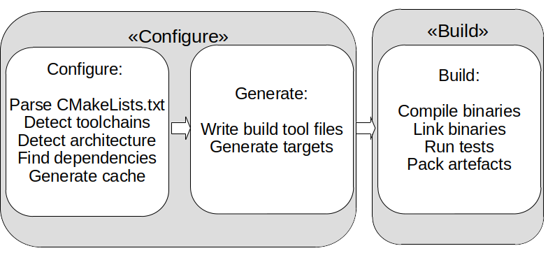
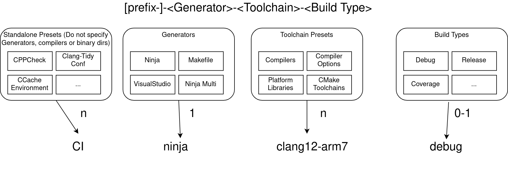
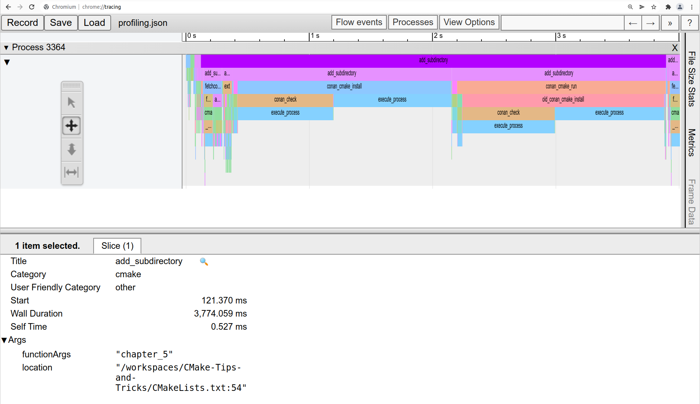

name: title
layout: true
class: center, middle, inverse

.footer[ [ @BernerDominik](https://twitter.com/BernerDominik)]
---

CMake Best Practices
===

### Dominik Berner


???

# Welcome

* ask about experience with CMake 
* Typical struggles, or concrete problems
* Tiniest of tiny introductions to CMake, then a few good practices and principles and then some nifty tricks

---

CMake in a nutshell
===

.left[
* CMake is a build-system generator or meta-build-system
* **Inputs**: source files, compiler-toolchain, build-environments and logical build targets 
* **Outputs**: instructions for build-systems (make, ninja, visual studio, xcode...) 
* Additional features include running tests, packaging, installing and custom commands like static code analysis etc.
]



---

A typical CMakeLists.txt
===

.left[

```cmake

project(myProject VERSION 1.0.0 LANGUAGES CXX)

find_package(OpenSSL REQUIRED COMPONENTS Crypto)

add_library(myLib lib.cpp)

add_executable(myApp main.cpp)

target_link_libraries(myApp PRIVATE myLib OpenSSL::Crypto)

```

]

???

define a project, find dependencies, add targets, link targets 

---

CMake Best Practices - The Book
===

.left-column[
 
]
.right-column[
.left[
 Get it from [packt](https://www.packtpub.com/product/cmake-best-practices/9781803239729): [https://cutt.ly/hMzUpiy](https://cutt.ly/hMzUpiy)

 
]
]
---

Overall Good Practice
===

.left[

1. **Platform-agnostic `CMakeLists.txt`**
2. presets > toolchain files > command line > env variables.
3. Use `target_*` commands over global ones.
5. package managers > FetchContent > ExternalProject > `add_subdirectory`
4. Leave decisions for `SHARED` or `STATIC` libraries to the user for library projects. 
5. `include` for modules, `add_subdirectory` for subprojects.
6. Make building of tests optional.
7. Frequently update CMake to the newest version.
8. ~~`add_exectuable(${PROJECT_NAME}`)~~

]

???

Compiler options: 
mandatory ones -> toolchain
optional ones such as -Wall etc presets 

BUILD_SHARED_LIBS

---

# Structure of a CMake Project

.left[
```bash

├── cmake
│   ├── MyModule.cmake
│   └── myTarget_sources.cmake # optional sources lists
*├── CMakeLists.txt #project, targets, dependencies, install & package instructions
├── doc
├── include  #for libraries only
│   └── projectname
│       └── public_header.h
├── src
│   └── code.cpp
├── test
*│   ├── CMakeLists.txt # Test targets, test-only dependencies 
│   └── src
│       └── test.cpp
└── CMakePresets.json
```
]

---

# Platform agnostic custom commands

.left[
* Use `cmake -E` to execute platform agnostic commands
  * `cmake -E <command>`
  * copy stuff, hashes, comparing files, etc
* For more complex ones use CMake in script mode
  * `cmake -P someScript.cmake` 
]


---


CMake Presets
===

"CMake presets (From 3.17) are the best thing since introduction of targets" - "CMake Best Practice"

.left[
* Presets define configuration settings for CMake
* Presets are stored in a `CMakePresets.json` file -> *Put this into git*
  * `CMakeUserPresets.json` for user-specific settings -> *Do not version this*
* Configure presets are the most common 
  * Use build presets for multi-config generators
* Aggregate and inherit (invisible) presets
* Use the override mechanism to change settings
* use `$env{HOME}` and variable expansion (i.e. `${sourceDir}`
]

???

* Who knows Presets? 

---

## CMake Presets - Configure example


.left[
```json
{
    "name": "ci-ninja-linux-debug",
    "displayName": "Ninja Linux Debug",
    "inherits": [
        "Qt-desktop",
        "ci-ninja"
    ],
    "cacheVariables": {
        "CMAKE_BUILD_TYPE": "Debug"
    },
    "generator": "Ninja",
    "binaryDir": "${sourceDir}/build"
},
```
]

---

# Presets - Organisation



.left[
  Examples:
  * `ci-linux-clang12-x86_64-debug` 
  * `ci-linux-gcc10-x86_64-release`
  * `dev-linux-release` -> No compiler specified, use system default
  * `ci-windows-msvc2019-x86_64` -> No build type specified, use build preset
]

---

Symbol Visibility in Libraries (DLLs)
===

.left[
  ```cmake

add_library(hello SHARED) # Prefer to let the user set SHARED or STATIC
*set_property(TARGET hello PROPERTY CXX_VISIBILITY_PRESET "hidden")
*set_property(TARGET hello  PROPERTY VISIBILITY_INLINES_HIDDEN True)

*include(GenerateExportHeader)

*generate_export_header(hello EXPORT_FILE_NAME export/hello/export_hello.hpp)

*target_include_directories(hello PUBLIC "${CMAKE_CURRENT_BINARY_DIR}/export")

set_target_properties(hello
    PROPERTIES VERSION ${PROJECT_VERSION}
               SOVERSION ${PROJECT_VERSION_MAJOR}
)


```
]

* ~~`set(CMAKE_WINDOWS_EXPORT_ALL_SYMBOLS True)`~~
* Don't forget to add the generated header to the install instructions!

---

# Large Codebases over multiple repos

.left[
* Use `FetchContent` to fetch centralized scripts, macros and presets
* Use a package manager for 3rd-Party dependencies
* Use build-containers and toolchain files for defining (cross-compilation) toolchains
* Make subprojects build standalone
* Use `ExternalProject` for non-CMake projects (i.e. autotools)
  * Use `FetchContent` for CMake projects
* CI runs should trigger downstream builds frequently
]
---

# Superbuilds With Non-CMake parts

.left[
```cmake
project(SuperbuildExample)
include(ExternalProject)
set(installDir ${CMAKE_CURRENT_BINARY_DIR}/install)

ExternalProject_Add(AnAutoToolsProject
  INSTALL_DIR ${installDir}
*  CONFIGURE_COMMAND <SOURCE_DIR>/configure --prefix <INSTALL_DIR>
*  BUILD_COMMAND make -j # Use find_program to find make first 
  ...
)

ExternalProject_Add(someDep2
  ...
  INSTALL_DIR ${installDir}
  CMAKE_ARGS -DCMAKE_INSTALL_PREFIX:PATH=<INSTALL_DIR> -DCMAKE_PREFIX_PATH:PATH=<INSTALL_DIR>

)
*ExternalProject_Add_StepDependencies(someDep2 configure AnAutoToolsProject)
``` 
]

???

The configure step of somedep depends on the completion of AnAutoTOolsProject

# Warning, ExternalProject happens during configuration time

---

Speeding up compilation - ccache
===

.left[

CMakeLists.txt
```cmake

find_program(CCACHE_PROGRAM ccache)
if(CCACHE_PROGRAM)
    set(CMAKE_C_COMPILER_LAUNCHER ${CCACHE_PROGRAM})
    set(CMAKE_CXX_COMPILER_LAUNCHER ${CCACHE_PROGRAM})
endif()

```

CMakePresets.json
```json

{
  "name": "ccache-env",
  "hidden": true,
  "environment": {
      "CCACHE_BASEDIR": "${sourceDir}",
      "CCACHE_SLOPPINESS": "pch_defines,time_macros"
  }
},
```

]

---


Speeding up compilation - Precompiled Headers
===

.left[
```cmake 
target_precompile_headers(ch14_precompiled_headers PRIVATE 
                          src/fibonacci.h
                          <cstdint>
                          <vector>
                          src/eratosthenes.h
                          )
```

* Generates a `cmake_pch.hxx.gch` in the build dir
* it is automatically included in all `.cpp` files
* automatically recompiled if the header changes
  * Disclaimer: It does not always work if there are external dependencies included.
]

---


Speeding up compilation - Unity Builds
===

.left[
  ```cmake

add_executable(my_unity_build)

target_sources(ch14_unity_build PRIVATE 
                src/main.cpp
                src/fibonacci.cpp
                src/eratosthenes.cpp
                )

# Enable unity build for the target
*set_target_properties(ch14_unity_build PROPERTIES UNITY_BUILD True)

# exclude eratosthenes.cpp from the unity build
set_source_files_properties(src/eratosthenes.cpp PROPERTIES
                          SKIP_UNITY_BUILD_INCLUSION YES)

  ```
]

---

Speeding up compilation - Unity Builds
===

.left[
  A file called `unity_0_cxx.cxx` is generated in the build directory

  ```CPP
  /* generated by CMake */

#include "/workspaces/CMake-Best-Practices/chapter14/unity_build/src/main.cpp"

#include "/workspaces/CMake-Best-Practices/chapter14/unity_build/src/fibonacci.cpp"
  ```
]

---

Speeding up CMake - profiling
===

.left[
```cmake

cmake -S <sourceDir> -B <buildDir> \ 
    --profiling-output ./profiling.json --profiling-format=google-trace

```
]



---

# Your turn -  Questions?

### C++ Coder, Agilist & Rock Climber
.left-column[
 
]
.right-column[
.left[
[ dominikberner.me](http://dominikberner.ch)

[ @BernerDominik](https://twitter.com/BernerDominik)

[ bernedom](https://github.com/bernedom)

[ dominik.berner@wingtra.com](mailto:dominik.berner@wingtra.com)
]
]
 

???

Brainstorm:

book plug 1 slide


* Presets - possible a bigger one by itself - OK
  * CMakePresets.json and CMAkeUserPrestes.json
  * Presets and cross compiling using toolchains 
  * inheriting 
* Cmake in script mode for platform independent commands -OK
* Test orchestration
  * test grouping/test parallization
  * test timeouts
  * test ressources 
  * defining fixtures 
  * Running tests in an emulator when cross compiling

* speeding up cmake 
  * cmake profiling - OK
  * unity builds
  * precompiled headers 
  * ccache
* CMake dependency graphs -OK
* DLL Symbol visibility
  * SHARED STATIC defined by preset -OK
* Dependency management
  find_package to rule them all
  * Upstream over find_package over FetchContent/ExternalProject

Small but useful
* export compile commands
* No ${PROJECT_NAME} targets - semantically different meaning - Kill the thing - OK

* Generator expressions - Explained

* custom commands / custom targets dependent on each other

* ccache
* sanitizers etc
  * Custom build types
  * Code coverage 
  * static code analysis (iwyu)

* Search order for sysroots (setting BOTH etc) - individual programs
* toolchain checks (very advanced) - NO

* Packaging and installing
* Q&A 


* ccmake and cmake-gui (console yay)
  * Tweaking environment variables
* conan integration instead of fetch content

---


Keep the overview with dependency graphs
===

`cmake --graphviz=my-project.dot /path/to/build/dir`


---
